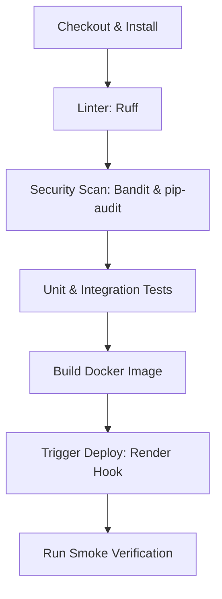

# Production CI/CD Pipeline & Security Scanning

This document describes the continuous integration, continuous delivery (CI/CD), and automated security scanning workflow configured for **PVAI**.

---

## 1. Pipeline Architecture (GitHub Actions)

Our pipeline, defined in `.github/workflows/ci_cd.yml`, automatically triggers on pushes or pull requests targeting `main` and `production` branches.

### Pipeline Stages

1. **Install:** Prepares python environment and caches dependencies.
2. **Lint:** Uses `ruff` to enforce code quality and formatting.
3. **Security Scan:**
   * **`pip-audit`:** Performs vulnerability checking on all project dependencies. Fails if high/critical CVEs exist.
   * **`bandit`:** Static Application Security Testing (SAST) scanning source python files for insecure imports, default keys, and weak encryption. Fails on High severity issues.
4. **Tests:** Runs the full unit and integration test suites using an in-memory SQL database.
5. **Docker Build:** Builds the backend container image to verify compilation using `backend/Dockerfile`.
6. **Deploy:** Triggers Render web service deployment hook (only on pushes to `production`).
7. **Smoke Test:** Runs automated scripts to confirm deployment health.

---

## 2. Secrets Configuration

To enable automated deployments, configure the following secret on GitHub:
* **Settings -> Secrets and variables -> Actions:**
  * Add **`RENDER_DEPLOY_HOOK`**: The deploy trigger URL copied from your Render Web Service dashboard under the *Deploy hook* section.
