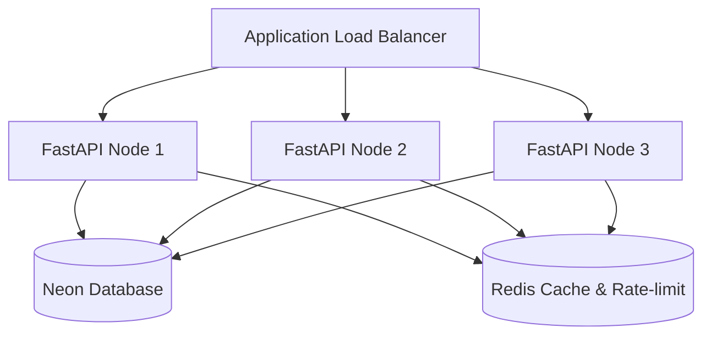

# Enterprise Scaling & High Availability Blueprint

This document details horizontal and vertical scaling blueprints for **PVAI** in enterprise environments.

---

## 1. Stateless Architecture

The backend application is completely stateless. Session state, authentication (JWT), and transactions reside outside the FastAPI containers (in Neon PostgreSQL, Cloudinary, and Redis).
This enables instant horizontal scaling:

---

## 2. Queue Scaling (Celery Integration Path)

Currently, the task queue runs as an in-memory thread pool inside FastAPI container memory.
To support heavy scale:
1. Swap `app/core/task_queue.py` to route tasks to a distributed worker system (e.g. Celery + RabbitMQ/Redis).
2. Spin up separate worker containers executing identical business functions, leaving the API containers 100% free to handle HTTP traffic.

---

## 3. Database Scaling (Neon Connection Pooling)

FastAPI nodes utilize connection pooling with a pool size of 20 and overflow limit of 10.
* For multi-node deployments, make sure database connection limits are configured to support `Nodes * Pool Size`.
* Connect using **Neon Transaction Pooling** connection endpoints (`-pooler` suffix in hostname) to share connections efficiently.
